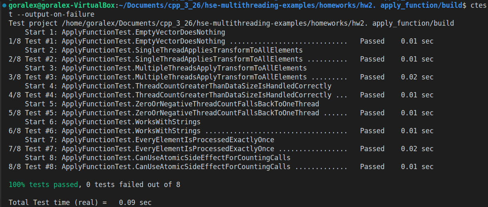
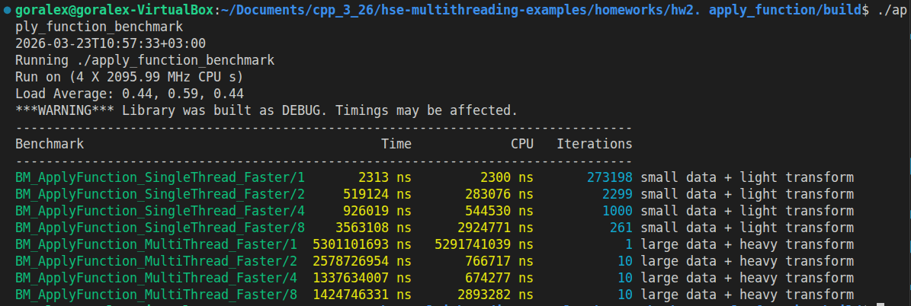

# ApplyFunction

Домашнее задание для лекции по теме "Процессы и потоки"

Реализуйте следующий метод:
```
template <typename T>
void ApplyFunction(std::vector<T>& data, const std::function<void(T&)>& transform, const int threadCount = 1);
```
Данный метод должен применить переданную функцию transform к каждому элементу вектора data. threadCount задает количество потоков, которое нужно использовать для применения функции. Если число потоков превышает число элементов, то число потоков следует взять равным числу элементов.

Напишите тесты для вашей реализации с использованием gtest.

Напишите бенчмарк для вашей реализации с использованием benchmark.

В бенчмарке отразите две ситуации -- когда однопоточная версия стабильно быстрее многопоточной и обратную ситуацию. Достигните этого как с помощью подбора размера вектора data, так и с помощью подбора функции transform.

Запуск:

```
rm -rf build
cmake -S . -B build -G Ninja -DCMAKE_BUILD_TYPE=Release
cmake --build build
./apply_function_tests
./apply_function_benchmark

```

## Тесты

1. EmptyVectorDoesNothing

Проверяет корректную обработку пустого вектора.
Если data пуст, функция не должна падать, создавать лишние потоки или менять состояние программы.

2. SingleThreadAppliesTransformToAllElements

Проверяет базовый однопоточный режим.
Функция преобразования должна быть применена ко всем элементам вектора, если threadCount = 1.

3. MultipleThreadsApplyTransformToAllElements

Проверяет корректность многопоточной обработки.
Вектор должен быть полностью обработан и результат должен совпадать с ожидаемым, даже если работа распределяется между несколькими потоками.

4. ThreadCountGreaterThanDataSizeIsHandledCorrectly

Проверяет требование из условия задачи: если число потоков больше числа элементов, фактическое количество потоков должно быть ограничено размером вектора.
Тест подтверждает, что лишние потоки не создаются, а результат остаётся корректным.

5. ZeroOrNegativeThreadCountFallsBackToOneThread

Дополнительный тест на устойчивость реализации.
Если передано нулевое или отрицательное число потоков, реализация переводит выполнение в однопоточный режим. Это делает функцию более безопасной.

6. WorksWithStrings

Проверяет шаблонность решения.
Функция должна работать не только с числами, но и с другими типами, например со std::string.

7. EveryElementIsProcessedExactlyOnce

Проверяет, что каждый элемент обрабатывается ровно один раз.
Это важно для корректного разбиения вектора на чанки между потоками и отсутствия пропусков или повторной обработки.

8. CanUseAtomicSideEffectForCountingCalls

Проверяет, что функция transform действительно вызывается для каждого элемента.
Для этого используется атомарный счётчик вызовов. Тест подтверждает, что число вызовов равно размеру вектора.



## Бенчмарки

1. Однопоточная версия быстрее многопоточной

BM_ApplyFunction_SingleThread_Faster

Небольшой вектор small data, очень лёгкая функция преобразования light transform, простое увеличение элемента.В такой задаче полезной работы мало, поэтому накладные расходы на создание потоков, распределение работы и ожидание join() оказываются больше, чем сама обработка элементов.

Результаты

```
BM_ApplyFunction_SingleThread_Faster/1       2313 ns
BM_ApplyFunction_SingleThread_Faster/2     519124 ns
BM_ApplyFunction_SingleThread_Faster/4     926019 ns
BM_ApplyFunction_SingleThread_Faster/8    3563108 ns
```

Здесь однопоточная версия оказалась намного быстрее всех многопоточных вариантов,

Причём видно, что с ростом числа потоков время только ухудшается, распараллеливание в такой задаче вредит производительности.

2. Многопоточная версия быстрее однопоточной

BM_ApplyFunction_MultiThread_Faster. Большой вектор large data, тяжёлая CPU-bound функция heavy transform, содержащая большое число математических операций. Здесь полезной работы на каждом элементе много, поэтому накладные расходы на потоки меньше полезной работы.

Результаты
```
BM_ApplyFunction_MultiThread_Faster/1  5301101693 ns
BM_ApplyFunction_MultiThread_Faster/2  2578726954 ns
BM_ApplyFunction_MultiThread_Faster/4  1337634007 ns
BM_ApplyFunction_MultiThread_Faster/8  1424746331 ns
```

Здесь многопоточность даёт выигрыш, при этом лучший результат в данном запуске -- 4 потока. Причина -- Run on (4 X 2095.99 MHz CPU s), доступно 4 логических CPU, и максимальный выигрыш достигается при числе потоков, соответствующем числу доступных ядер.Попытка использовать 8 потоков уже не даёт улучшения и даже немного ухудшает результат из-за лишнего переключения контекста и конкуренции за CPU.



## Выводы

1. Многопоточность полезна не всегда

Бенчмарк на маленьком векторе и лёгкой функции показывает, что многопоточность может быть медленнее однопоточного варианта.
Причина -- накладные расходы на потоки оказываются выше, чем стоимость самой обработки.

2. Многопоточность даёт выигрыш на тяжёлых задачах

Бенчмарк на большом векторе и тяжёлой функции показывает обратную картину: при достаточном объёме вычислений многопоточная версия ускоряет выполнение в разы.

3. Оптимальное число потоков связано с числом доступных CPU

На данной машине лучший результат достигнут при 4 потоках, что соответствует 4 доступным логическим CPU. Увеличение числа потоков сверх этого значения не улучшает производительность.