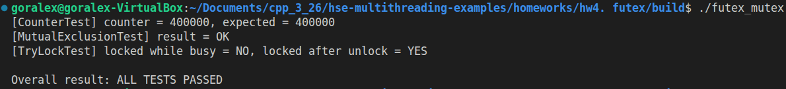

# Домашнее задание для лекции по теме "Системный вызов futex, устройство кэша, модель памяти C++"

В этой домашней работе два варианта:

* Вариант #1 -- реализовать аналог std::mutex с использованием системного вызова futex.

## Тесты

1. CounterTest -- проверка корректности взаимного исключения на общем счётчике.
В этом тесте создавались 4 потока, каждый из которых выполнял по 100000 инкрементов общей переменной counter. Каждый инкремент выполнялся внутри критической секции, защищённой реализованным FutexMutex. Если бы mutex работал некорректно, часть инкрементов терялась бы из-за гонки данных, и итоговое значение счётчика оказалось бы меньше ожидаемого.
В результате теста было получено:
counter = 400000, expected = 400000.
Это означает, что все инкременты были выполнены корректно, а доступ к разделяемым данным действительно был сериализован.

2. MutualExclusionTest -- проверка свойства взаимного исключения.
Во втором тесте проверялось, может ли более одного потока одновременно оказаться внутри критической секции. Для этого использовалась атомарная переменная inside, которая увеличивалась при входе в критическую секцию и уменьшалась при выходе. Если в какой-либо момент значение inside становилось больше 1, это означало бы нарушение свойства mutex и одновременное нахождение двух потоков внутри защищённого участка кода.
Дополнительно внутри критической секции выполнялся std::this_thread::yield(), чтобы повысить вероятность переключения потоков и сделать тест более стрессовым.
Результат теста:
result = OK.
Это подтверждает, что реализованный mutex действительно обеспечивает взаимное исключение.

3. TryLockTest -- проверка неблокирующего захвата.
В этом тесте отдельно проверялась корректность метода try_lock(). Сначала основной поток захватывал mutex с помощью lock(). После этого другой поток вызывал try_lock(). Ожидалось, что при уже занятом mutex метод вернёт false. Затем после освобождения mutex повторно выполнялся try_lock(), и на этот раз ожидался успешный захват.
Результат теста:
locked while busy = NO, locked after unlock = YES.
Это показывает, что метод try_lock() корректно отличает занятое состояние mutex от свободного и работает в соответствии с ожидаемой семантикой.

